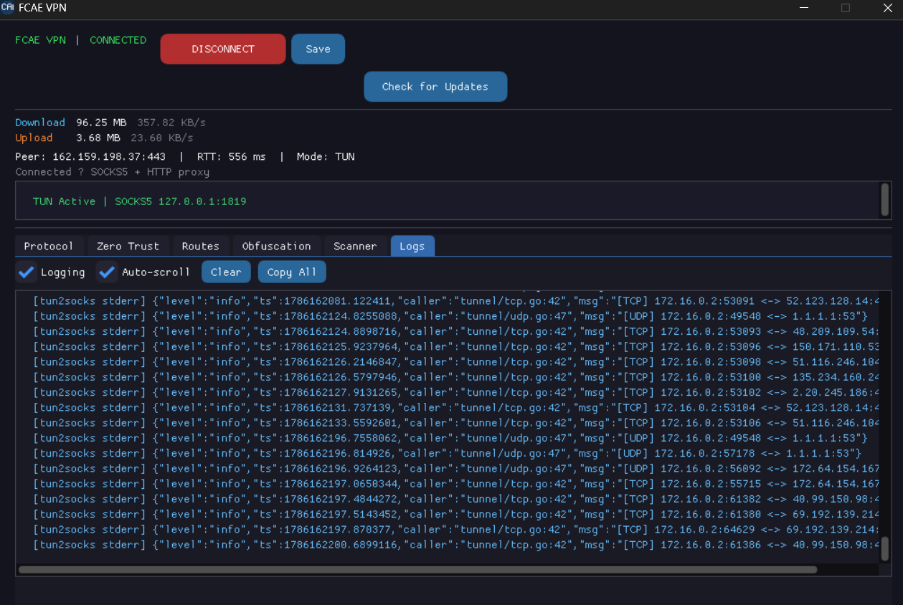
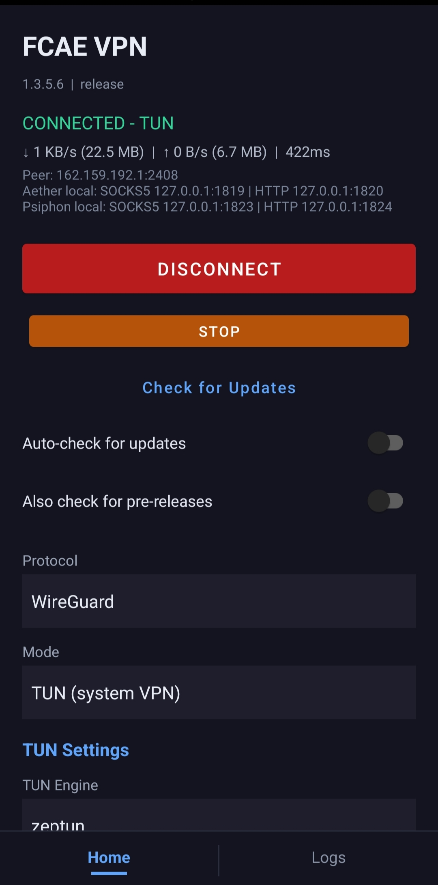

<p align="center">
  
</p>

# FCAE VPN

**[English](README.md)** | **[فارسی](READMEFA.md)** | **中文**

一款为高度受限网络设计的审查绕过客户端。它会自动发现可达路由，建立加密隧道，并为您的应用程序暴露本地 SOCKS5/HTTP 代理。

基于 **[Aether](https://github.com/CluvexStudio/aether)** 构建，提供 Windows、Linux、macOS 和 Android 的原生 GUI 前端。

## 工作原理

FCAE VPN 连接到 **Cloudflare 的 WARP 网络** — 与 Cloudflare 1.1.1.1 DNS 服务背后相同的基础设施。流程如下：

1. **账户配置** — 首次启动时，客户端会创建一个 WARP 设备身份，并从 Cloudflare 的注册 API 获取专用的 IPv4/IPv6 地址和 WireGuard 密钥对。
2. **端点扫描** — 客户端会在多个端口上探测一系列 Cloudflare 边缘 IP，以找到可达的网关。每个候选节点都会通过真实的握手（在 ironclad 模式下可选完整的 HTTP 请求）进行验证，以确认该路由确实可以传输流量。
3. **隧道建立** — 找到可用的边缘节点后，会建立一条加密隧道：
   - **MASQUE** — 流量使用 `CONNECT-IP` 方法封装在 HTTP/3 (QUIC) 或 HTTP/2 (TLS) 会话中，使其在 DPI 系统看来像普通的 HTTPS 流量。
   - **WireGuard** — 直接向边缘节点建立标准的 WireGuard UDP 隧道。
   - **WARP-in-WARP (gool)** — 两层嵌套的 WireGuard 隧道，提供额外的加密层。
4. **本地代理** — 隧道暴露一个本地 SOCKS5 代理（端口 1819）和 HTTP 代理（端口 1820）。配置为使用这些代理的应用程序会将其流量通过加密隧道经由 Cloudflare 网络传输到互联网。

客户端与 Cloudflare 之间的所有流量均已加密。从 Cloudflare 之后，流量正常出口到公共互联网。

### 架构图

```
┌─────────────────────────────────────────────────────────────────────┐
│                         您的应用程序                                  │
│              （浏览器、应用或通过 TUN 的系统流量）                      │
└──────────────────────────────┬──────────────────────────────────────┘
                               │ SOCKS5 :1819 / HTTP :1820
                               ▼
┌─────────────────────────────────────────────────────────────────────┐
│                       FCAE VPN 客户端                                │
│  ┌────────────┐  ┌────────────┐  ┌────────────┐  ┌──────────────┐   │
│  │  网络栈     │  │  扫描器     │  │  混淆模块   │  │  健康监控     │   │
│  │ (TCP/IP)   │  │ (端点       │  │  (aether-  │  │  (故障时     │   │
│  │            │  │  发现)      │  │   noize)   │  │   自动重连)  │   │
│  └──────┬─────┘  └────────────┘  └────────────┘  └──────────────┘   │
│         │                                                           │
│         ▼                                                           │
│  ┌──────────────────────────────────────────────────────────────┐   │
│  │                      加密隧道                                 │   │
│  │   ┌───────────┐   ┌──────────────┐   ┌──────────────────┐    │   │
│  │   │  MASQUE   │   │  WireGuard   │   │  WARP-in-WARP    │    │   │
│  │   │ HTTP/3/2  │   │   (UDP)      │   │  (WG 套 WG)      │    │   │
│  │   └─────┬─────┘   └──────┬───────┘   └────────┬─────────┘    │   │
│  └─────────┼────────────────┼────────────────────┼──────────────┘   │
└────────────┼────────────────┼────────────────────┼──────────────────┘
             │                │                    │
             ▼                ▼                    ▼
┌─────────────────────────────────────────────────────────────────────┐
│                    Cloudflare WARP 边缘节点                          │
│              (162.159.192.x — 自动发现)                              │
└──────────────────────────────┬──────────────────────────────────────┘
                               │
                               ▼
┌─────────────────────────────────────────────────────────────────────┐
│                         公共互联网                                   │
└─────────────────────────────────────────────────────────────────────┘
```

### 协议对比

| 协议 | 传输方式 | DPI 抗性 | 速度 | 适用场景 |
|----------|-----------|-------------------|-------|----------|
| **MASQUE (HTTP/3)** | QUIC over UDP | 最佳 — 看起来像 HTTPS | 快 | 默认，最强抗审查能力 |
| **MASQUE (HTTP/2)** | TLS over TCP | 最佳 — 看起来像 HTTPS | 快 | QUIC 被封禁时的备选 |
| **WireGuard** | UDP | 中等 — 加密但可被检测 | 最快 | UDP 被允许时使用 |
| **WARP-in-WARP** | 嵌套 UDP | 高 — 双重加密 | 中等 | 单独 WG 被封禁时的额外层 |

## 功能特性

- 自动端点发现，端到端数据面验证
- 支持 MASQUE (HTTP/3 QUIC / HTTP/2)、WireGuard 和 WARP-in-WARP (gool)
- 可配置的流量混淆配置文件
- 自动重连，支持快速重连
- 本地 SOCKS5 和 HTTP 代理
- 所有平台原生 GUI（桌面端 ImGui + DirectX11/OpenGL，Android 端 Kotlin Material UI）

## 内联路由规则

您可以直接在 UI（Routes 选项卡）中定义自定义路由规则，无需外部文件。规则使用简单格式：

```
[direct]ip:190.9.2.4,192.33.45.6:400,example.com
[block]gazo.com,10.0.0.0/8,keyword:ads
```

**格式说明：**
- `[direct]` — 匹配的流量绕过 VPN（直连）
- `[block]` — 匹配的流量完全阻止
- 条目可用逗号或换行分隔
- 无前缀条目默认为 `[direct]`

**支持的规则类型：**
| 类型 | 示例 | 说明 |
|------|---------|-------------|
| 普通域名 | `example.com` | 匹配域名及所有子域名 |
| 完整域名 | `full:example.com` | 仅精确匹配域名 |
| 关键词 | `keyword:ads` | 域名包含关键词即匹配 |
| 正则表达式 | `regexp:^ad[0-9]+\.` | 正则模式匹配 |
| IP / CIDR | `10.0.0.0/8`, `1.2.3.4` | IP 地址或 CIDR 范围 |
| 端口 | `port:25`, `port:3000-3010` | 端口或端口范围 |
| 私有地址 | `private` | 所有局域网/私有 IP |
| IP 带端口 | `192.33.45.6:400` | 带指定端口的 IP 地址 |

**桌面端：** 打开 **Routes** 选项卡，将规则粘贴到 "Inline Routing Rules" 文本框中。

**Android 端：** 滚动到 "Inline routing rules" 并输入您的规则。点击 **CONNECT** 应用。

通过内联输入设置的规则优先级更高，并与 "Routing Rules File" 字段中指定的任何规则文件合并。

## 支持平台

| 平台 | 后端 | UI |
|----------|---------|----|
| Windows | DirectX 11 | ImGui |
| Linux | GLFW + OpenGL | ImGui |
| macOS | GLFW + OpenGL | ImGui |
| Android | Kotlin Material VpnService + JNI 桥接 | Kotlin Material UI |

### 界面截图

<p align="center">
  
  &nbsp;
  
</p>

## 构建

### 依赖要求

- Rust（最新稳定版）
- C/C++ 编译器（GCC/Clang/MSVC）
- CMake >= 3.22
- Vulkan SDK 或 DirectX SDK（Windows）
- Android 构建需要：NDK、Android SDK、Kotlin

### 首先构建 Rust 引擎

```bash
cargo build --manifest-path core/Cargo.toml -p aether-ffi --release
```

### 构建原生 GUI

```bash
cmake -B build -DAETHER_TARGET=LINUX_X64
cmake --build build --config Release
```

目标平台：`LINUX_X64`、`WIN_X64`、`MACOS_ARM64`、`MACOS_X64`、`ANDROID_ARM64`。

### Android

在 Android Studio 中打开 `android/` 目录并构建。Gradle 配置会自动使用 `ANDROID_ARM64` 调用 CMake。

## 致谢

- **[Aether](https://github.com/CluvexStudio/aether)** — 由 CluvexStudio 开发的核心审查绕过引擎。提供 MASQUE、WireGuard 和 WARP-in-WARP 协议。
- **[Dear ImGui](https://github.com/ocornut/imgui)** — 即时模式 GUI 库，用于所有原生桌面渲染。
- **[Quiche](https://github.com/cloudflare/quiche)** — Cloudflare 的 HTTP/3 和 QUIC 实现。作为 MASQUE 协议支持的 QUIC 传输后端。
- **[Wintun](https://www.wintun.net/)** — 由 WireGuard 开发的 Windows TUN 驱动程序。提供高性能的第 3 层网络接口，用于隧道传输流量。
- **[tun2socks](https://github.com/xjasonlyu/tun2socks)** — 一个 Go 库，可透明地将 TUN 设备流量通过 SOCKS5 代理路由。为 Linux、Windows 和 macOS 上的系统级 VPN TUN 模式提供支持（Android 使用自定义 TUN 实现）。

## 贡献

欢迎贡献！无论是错误报告、功能请求、文档改进还是代码贡献 — 都可以提交 Issue 或 Pull Request。

### 如何贡献

1. Fork 本仓库
2. 创建功能分支 (`git checkout -b feature/amazing-feature`)
3. 提交更改 (`git commit -m 'Add amazing feature'`)
4. 推送到分支 (`git push origin feature/amazing-feature`)
5. 创建 Pull Request

## 许可证

请参阅各组件的相应许可证。

---

<div align="center">

### 觉得有用？

如果这个项目帮助您绕过了审查，或者为您节省了时间，请考虑给一个 **Star** — 这能帮助更多人发现这个工具，也是持续开发的动力。

[](https://github.com/FCFlenkchy/FCAE_VPN)

</div>